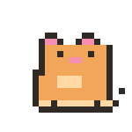
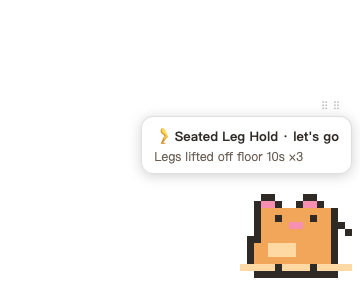
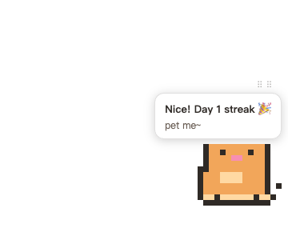

# micro-pet · Micro-workout Desk Pet

> A pixel cat that demonstrates seated micro-exercises in the corner of your screen — pet it to check in, grow your streak locally. It accompanies you; it never interrupts you.

[简体中文](README.md)

| Idle | Reminder (let's go) | Checked in |
|:---:|:---:|:---:|
|  |  |  |

## What are micro-exercises?

**30–60 second seated movements** (heel raises, shoulder-blade squeezes, belly breathing…) that break up sitting whenever there's a gap — no gear, no time block. Research: 5 minutes of light walking every 30 minutes cuts post-meal glucose spikes by 58%; a median 4.4 min/day of incidental activity is associated with 26–30% lower all-cause mortality. Made for sedentary engineers, knowledge workers, and meeting-marathon survivors. → **[Full guide: definition · science · audience · the 7 built-in exercises](docs/micro-exercises.en.md)**

## Install (macOS · Apple Silicon)

```bash
brew install --cask liyuankui/tap/micro-pet
```

The app is unsigned: on first launch right-click → Open (or run `xattr -dr com.apple.quarantine /Applications/micro-pet.app` in a terminal first). Alternatively grab the zip from [Releases](https://github.com/liyuankui/workoutpet/releases) and drop it into /Applications.

## 🤖 Paste to your agent

Paste this to your AI assistant (ZCode / Claude / WorkBuddy, etc.) — it fetches the docs itself, installs and verifies, then interviews you for a personalized plan:

```text
Please install and configure the micro-pet desk pet for me following these two documents:
1. Install: https://raw.githubusercontent.com/liyuankui/workoutpet/master/docs/agent-install-prompt.en.md
2. Then customize my reminder schedule: https://raw.githubusercontent.com/liyuankui/workoutpet/master/docs/agent-setup-prompt.en.md
```

Read the docs directly: [Install](docs/agent-install-prompt.en.md) · [Setup](docs/agent-setup-prompt.en.md) (also one-click copy from the menu-bar cat)

## How it works

- Every hour (configurable 30–120 min) the cat demonstrates a random micro-exercise with a speech bubble; if you ignore it for 2 minutes it quietly goes back (no nagging)
- **Click the cat during a reminder = check in** (happy + streak)
- **Click any other time = random reaction**: wiggle / jump / meow~ / roll (500ms throttle)
- Bilingual (zh-CN / en): follows your system language, switchable from the tray
- Weekly report: tray "Copy Weekly Report"; data lives in `~/.micro-pet/streak.json`

## Configuration (`~/.micro-pet/`)

| File | Field | Description |
|------|-------|-------------|
| `config.json` | `intervalMin` | Reminder interval in minutes, 30–120, default 60; **used only when no `schedule` is set** |
| | `schedule` | **Time-window scheduling**: different densities per time of day; outside all windows the cat stays silent (no reminders after work / at night). Densify around lunch and the afternoon slump |
| | `goalDaily` | Daily check-in goal (1–30); when set, the streak counts "goal-met days" and the report shows N/goal |
| | `enabledExercises` | Exercise id whitelist (default all); the cat auto-rotates lower/upper/hands/core categories for balance |
| | `locale` | `"zh-CN"` / `"en"`; defaults to system language (tray switch writes here) |
| | `brx` / `bry` | Cat's bottom-right corner; saved on drag, restored on restart |
| `exercises.json` | — | **Custom exercise library** (overrides the built-in when present), see below |
| `streak.json` | — | Check-in data, purely local; delete to reset |

`schedule` example (sparse focused morning / denser around lunch / densest in the afternoon slump / easing off):

```json
{
  "goalDaily": 8,
  "schedule": {
    "windows": [
      { "from": "09:00", "to": "11:30", "intervalMin": 75 },
      { "from": "11:30", "to": "13:30", "intervalMin": 40 },
      { "from": "13:30", "to": "15:30", "intervalMin": 35 },
      { "from": "15:30", "to": "18:00", "intervalMin": 60 }
    ]
  }
}
```

### 🤖 Let your AI customize it (prompt-as-settings)

No manual JSON editing — click the menu-bar cat → **"Copy AI Setup Assistant Prompt"** and paste it to your AI assistant. It will interview you (routine / lunch / slump times / goals / reminders-per-day / exercise preferences), then generate and write the config; validate with `micro-pet validate-config` and restart. Full interview instructions: [docs/agent-setup-prompt.en.md](docs/agent-setup-prompt.en.md).

### Custom exercises

```bash
micro-pet init-exercises   # writes a template to ~/.micro-pet/exercises.json (from source: bun run src/bin/micro-pet.ts init-exercises)
```

Edit the template, restart the app. Fields:

| Field | Required | Notes |
|-------|----------|-------|
| `id` | ✓ | kebab-case, unique |
| `name` / `cue` | ✓ | `{"zh-CN": "…", "en": "…"}` ("zh-CN" required, "en" optional with zh fallback) |
| `steps` | ✓ | ≥2 steps per language |
| `durationSec` | ✓ | 10–120 |
| `animation` | ✓ | `stretch/neck/wrists/legs/heels/shoulders/breath` (animation mapping) |
| `emoji` | ✓ | shown in the bubble |

If the JSON is invalid or fields are missing, the app **falls back to the built-in library** instead of crashing (see `~/.micro-pet/boot.log`).

## Development

```bash
bun install
cd node_modules/electron && ELECTRON_MIRROR="https://npmmirror.com/mirrors/electron/" node install.js && cd ../..  # bun blocks postinstall; install the binary manually
bun start                    # build & launch
bun test                     # 50 tests
```

Demo mode: `MICROPET_INTERVAL_SEC=5 bun start`.

## Decision log

- **Electron over Tauri** (2026-09-04): local Xcode CLT was broken (`cc` dlopen failure), Rust linking would fail; Electron ships prebuilt binaries with no local compilation, while main/renderer stay fully TS.
- **Dedicated bundle id** `com.liyuankui.micro-pet` (2026-09-05): the default id got its LaunchServices registration poisoned by a quarantined first launch, causing silent launch refusal.
