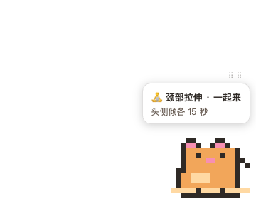
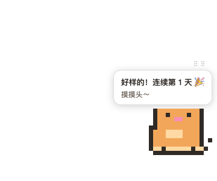

# micro-pet · 微运动桌宠

> 一只像素猫，定时在屏幕角落示范坐姿微运动——摸头打卡，本地养 streak。「陪着你」，而非「打断你」。

[English](README.en.md)

| 静候 | 提醒（一起来） | 打卡成功 |
|:---:|:---:|:---:|
|  |  |  |

## 什么是微运动？

**30-60 秒一次的坐姿小动作**（提踵、肩胛后缩、收腹呼吸…），见缝插针打断久坐——不用换衣服不用占时间。研究显示：每半小时起身活动 5 分钟可使餐后血糖峰值降 58%；日常零散活动每天 4.4 分钟与全因死亡风险降 26-30% 相关。适合久坐的工程师/知识工作者与会海中的打工人。→ **[详细介绍：定义 · 科学依据 · 受众 · 7 个内置动作](docs/micro-exercises.md)**

## 安装（macOS · Apple Silicon）

```bash
brew install --cask liyuankui/tap/micro-pet
```

未签名应用，首次打开需**右键 → 打开**（或在终端 `xattr -dr com.apple.quarantine /Applications/micro-pet.app` 后直接开）。也可从 [Releases](https://github.com/liyuankui/workoutpet/releases) 下载 zip 手动解压到 /Applications。

## 🤖 Paste to your agent

把下面这段直接粘给你的 AI 助手，让它替你装好并验证：

```text
帮我在这台 Mac 上安装并验证微运动桌宠 micro-pet：
1. 执行 brew install --cask liyuankui/tap/micro-pet
2. 未签名首启处理：xattr -dr com.apple.quarantine /Applications/micro-pet.app
3. 启动：open /Applications/micro-pet.app
4. 等待 8 秒后验证：cat ~/.micro-pet/heartbeat.json 应存在且 "visible": true，
   屏幕右下角应出现一只橘色像素猫
5. 菜单栏小猫图标可：立刻提醒（演示）/ 切换语言 / 复制周报 / 退出
```

## 怎么用

- 猫每小时（可配 30-120 分钟）随机示范一个微运动 + 气泡指引，2 分钟不理它就安静回去（不催促）
- **提醒状态点猫 = 打卡**（happy + 记 streak）
- **平时点猫 = 随机互动**：蹭蹭 / 跳一下 / 喵～ / 打滚（500ms 节流）
- 中英双语：跟随系统语言，托盘可切换
- 周报：托盘「复制周报」或 `bunx --bun micro-pet report`（需源码环境），数据在 `~/.micro-pet/streak.json`

## 配置（`~/.micro-pet/`）

| 文件 | 字段 | 说明 |
|------|------|------|
| `config.json` | `intervalMin` | 提醒间隔分钟，30-120，默认 60；改后重启 app 生效 |
| | `locale` | `"zh-CN"` / `"en"`；缺省跟随系统（托盘切换即写此处） |
| | `brx` / `bry` | 猫的右下角坐标，拖动后自动保存，重启保持 |
| `exercises.json` | — | **自定义动作库**（存在即覆盖内置），见下 |
| `streak.json` | — | 打卡数据，纯本地；删除即重置 |

### 自定义动作库

```bash
micro-pet init-exercises   # 生成模板 ~/.micro-pet/exercises.json（需源码环境：bun run src/bin/micro-pet.ts init-exercises）
```

编辑模板后重启 app 生效。字段：

| 字段 | 必填 | 说明 |
|------|------|------|
| `id` | ✓ | kebab-case，唯一 |
| `name` / `cue` | ✓ | `{"zh-CN": "…", "en": "…"}`（zh-CN 必填，en 可选，缺失回退中文） |
| `steps` | ✓ | 每语言 ≥2 步 |
| `durationSec` | ✓ | 10-120 |
| `animation` | ✓ | `stretch/neck/wrists/legs/heels/shoulders/breath`（动画映射） |
| `emoji` | ✓ | 气泡展示用 |

JSON 非法或字段缺失时**自动回退内置库**，不会崩（`~/.micro-pet/boot.log` 可查加载来源）。

## 开发

```bash
bun install
cd node_modules/electron && ELECTRON_MIRROR="https://npmmirror.com/mirrors/electron/" node install.js && cd ../..  # bun 拦 postinstall，需手动装二进制
bun start                    # 构建并启动
bun test                     # 50 项测试
```

演示模式：`MICROPET_INTERVAL_SEC=5 bun start`。架构与产品约束见 `src/` 注释与本地知识库 harness。

## 决策记录

- **Electron 而非 Tauri**（2026-09-04）：本机 Xcode CLT 损坏（`cc` dlopen 失败），Rust 链接必挂；Electron 预编译二进制无本地编译依赖，主进程/渲染端仍全 TS。
- **专属 bundle id** `com.liyuankui.micro-pet`（2026-09-05）：默认 id 曾被 Gatekeeper 首启拦截污染 LaunchServices 注册，静默拒启。
